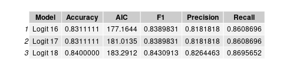

# Occupation Is Analytical?

## Project Objective
The purpose of the project is to categorize occupations as being either
analytical or not analytical.

## Methods
* Exploratory Data Analysis
* Data Visualization
* Data Transformation
* Backwards Stepwise Logistic Regression
* Linear Discriminant Analysis
* Quadratic Discriminant Analysis

## Technologies
* R
* R Packages:
  * ggplot2
  * dplyr
  * gridExtra
  * tidyr
  * MASS
        
## Project Description
This project categorizes occupations as either analytical or not analytical
using occupational skill sets and attributes described by 0*NET as inputs.

The dependent variable is binary. Either the occupation is or it is not
analytical. An occupation is considered to be analytical if its Analytical
Importance is equal to or greater than 0.50. Otherwise, it is considered to be
not analytical.

The feature set includes: Category Flexibility, Deductive Reasoning, Flexibility
of Closure, Fluency of Ideas, Inductive Reasoning, Information Ordering,
Mathematical Reasoning, Memorization, Number Facility, Oral Comprehension, Oral
Expression, Originality, Perceptual Speed, Problem Sensitivity, Selective
Attention, Spatial Orientation, Speed of Closure, Time Sharing, Visualization,
Written Comprehension, and Written Expression.

Three models are implemented: Logistic Regression, Linear Discriminant Analysis,
and Quadratic Discriminant Analysis.

## Results
The logistic regression with all of the features included resulted in an AIC of
195.38 and an accuracy of 0.8622. Precision and recall are 0.8559 and 0.8783,
respectively. And, the F1 is 0.8670. Unfortunately, only Inductive Reasoning
and Spatial Orientation are statistically signifcant.

Beginning with the model above, new logistic regression models were created by
removing the feature with the lowest statistical significance as measured by
its p-value. This process, known as Backwards Stepwise Logistic Regression, was
repeated 18 times until all remaining features were significant at the 99
percent level. The three most promising of those models are described below.

Model 16 is the first model where all features are statistically significant. It
has an AIC of 177.16 and an accuracy of 0.8311. Each feature is statistically significant at the 95 percent level or greater. Problem Sensitivity,
Visualization, and Spatial Orientation are significant at the 95 percent level.
Mathematical Reasoning is significant at the 99 percent level. And, Written
Expression is significant at the 99.9 percent level.

Model 17 has the same performance metrics except for the AIC which is 181.01. 
Each feature is significant at the 95 percent level or greater. Spatial
Orientation is significant at the 95 percent level. Mathematical Reasoning is
significant at the 99 percent level. And, Problem Sensitivity and Written
Expression are significant at the 99.9 percent level.

Model 18 has an AIC of 183.29 and an accuracy of 0.8400. Each feature is
statistically significant at the 99 percent level or greater. Mathematical
Reasoning and Problem Sensitivity are significant at the 99 percent level. And,
Written Expression is significant at the 99.9 percent level.

## Getting Started
1. Clone this repo.
2. Data for this project can be found in /assets.
3. Plots generated by this analysis can be found in /plots.

## License
MIT License

Copyright (c) 2021 Justin Bosscher

Permission is hereby granted, free of charge, to any person obtaining a copy
of this software and associated documentation files (the "Software"), to deal
in the Software without restriction, including without limitation the rights
to use, copy, modify, merge, publish, distribute, sublicense, and/or sell
copies of the Software, and to permit persons to whom the Software is
furnished to do so, subject to the following conditions:

The above copyright notice and this permission notice shall be included in all
copies or substantial portions of the Software.

THE SOFTWARE IS PROVIDED "AS IS", WITHOUT WARRANTY OF ANY KIND, EXPRESS OR
IMPLIED, INCLUDING BUT NOT LIMITED TO THE WARRANTIES OF MERCHANTABILITY,
FITNESS FOR A PARTICULAR PURPOSE AND NONINFRINGEMENT. IN NO EVENT SHALL THE
AUTHORS OR COPYRIGHT HOLDERS BE LIABLE FOR ANY CLAIM, DAMAGES OR OTHER
LIABILITY, WHETHER IN AN ACTION OF CONTRACT, TORT OR OTHERWISE, ARISING FROM,
OUT OF OR IN CONNECTION WITH THE SOFTWARE OR THE USE OR OTHER DEALINGS IN THE
SOFTWARE.
