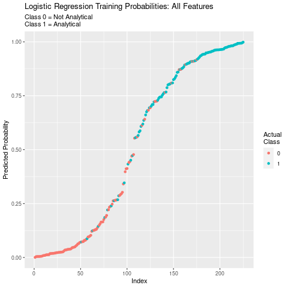
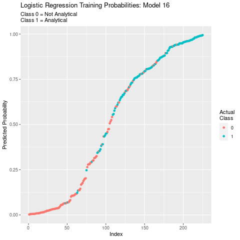

# Occupation Is Analytical?
## Project Objective
The purpose of the project is to categorize occupations as being either
analytical or not analytical.

## Methods
* Exploratory Data Analysis
* Data Visualization
* Feature Selection
* Backwards Stepwise Logistic Regression
* Linear Discriminant Analysis
* Quadratic Discriminant Analysis

## Technologies
* R
* R Packages:
  * ggplot2
  * dplyr
  * corrplot
  * ppcor
  * mctest
  * gridExtra
  * tidyr
  * MASS

## Getting Started
1. Clone this repo.
2. Data for this project can be found in /assets.
3. Plots generated by this analysis can be found in /plots.
        
## Project Description
This project categorizes occupations as either analytical or not analytical
using occupational skill sets and attributes described by 0*NET as inputs.

The dependent variable is binary. Either the occupation is or it is not
analytical. An occupation is considered to be analytical if its Analytical
Importance is equal to or greater than 0.50. Otherwise, it is considered to be not analytical.

The feature set includes: Category Flexibility, Deductive Reasoning, Flexibility of Closure, Fluency of Ideas, Inductive Reasoning, Information Ordering, Mathematical Reasoning, Memorization, Number Facility, Oral Comprehension, Oral Expression, Originality, Perceptual Speed, Problem Sensitivity, Selective Attention, Spatial Orientation, Speed of Closure, Time Sharing, Visualization, Written Comprehension, and Written Expression.

Three models are implemented: Logistic Regression, Linear Discriminant Analysis, and Quadratic Discriminant Analysis.

## Training Models Results
### Logistic Regression
The logistic regression with all of the features included resulted in an AIC of 195.38 and an accuracy of 0.8622. Precision and recall are 0.8559 and 0.8783, respectively. And, the F1 is 0.8670. Unfortunately, only Inductive Reasoning and Spatial Orientation are statistically signifcant.

Below is a plot of the probabilities predicted by the model. Predicted probabilities are plotted against the index of observations ordered by the respective predicted probabilities. Each data point has been colored by its actual classification.

Beginning with the model above, new logistic regression models were created by removing the feature with the lowest statistical significance as measured by its p-value. This process, known as Backwards Stepwise Logistic Regression, was repeated 18 times until all remaining features were significant at the 99.0 percent level.

Below is a plot of the distribution of the predicted probabilities. Both the mean and the median are displayed. This is a great way to visualize the separability of the two predicted classes.

Performance metrics for the three most promising logistic regression models are described below.

TODO: Create predicted probability distributions for Logit Models 16-18 and stack them. Display. Discuss.

As a reminder, precision is the ratio of occupations correctly predicted to be analytical versus all occupations that are predicted to be analytical. It is the number of occupations correctly predicted to be analytical divided by the total number of occupations predicted to be analytical. A high precision should yield a low false positive rate.

Recall is the ratio of all correctly predicted occupations divided by the number of occupations that are actually analytical. It reflects a model's ability to correctly identify analytical occupations among all occupations that are actually analytical.

The F1 score is an equally weighted average of precision and recall. It balances precision and recall by taking both false positives and false negatives into account.

AIC is a metric which assesses a model's ability to fit to the data and which penalizes models for including a greater number of parameters.

Model 16 is the first model where all features are statistically significant. It has an AIC of 177.16 and an accuracy of 0.8311. Each feature is statistically significant at the 95.0 percent level or greater. Problem Sensitivity, Visualization, and Spatial Orientation are significant at the 95.0 percent level. Mathematical Reasoning is significant at the 99.0 percent level. And, Written Expression is significant at the 99.9 percent level. A plot of the distribution of its predicted probabilities is below.

Below is a plot of the correlations between the features in the logistic regession Model 16.

Model 17 has the same performance metrics except for the AIC which is 181.01. Each feature is significant at the 95.0 percent level or greater. Spatial Orientation is significant at the 95.0 percent level.   Mathematical Reasoning is significant at the 99.0 percent level. And, Problem Sensitivity and Written Expression are significant at the 99.9 percent level. Below is a plot of the distribution of the probabilities predicted by Model 17.

Model 18 has an AIC of 183.29 and an accuracy of 0.8400. Each feature is
statistically significant at the 99.0 percent level or greater. Mathematical Reasoning and Problem Sensitivity are significant at the 99.0 percent level. And, Written Expression is significant at the 99.9 percent level. A plot of the distribution of predicted probabilities from Model 18 is below.

Among Model 16 and Model 17, there is no difference in accuracy, F1, precision, or recall. The AIC for Model 16 is lower than that of Model 17 making Model 16 the preferred specification between the two.

Model 18 increases in accuracy, precision, recall, and F1 over Model 16. However, it has an AIC which is more than 5 points higher than that of Model 16. And, this is despite the fact that it has fewer parameters. Here, sacraficing a small amount of accuracy for the possibility of future shifts in occupational requirements makes sense. Including one or more of the previous variables that have been taken out will, hopefully allow the model to do just that. And, for these reasons, Model 16 is the preferred specification. Below is a plot of the probabilities predicted by Model 16 plotted against the index of observations ordered by the predicted proababilities. Each data point has been colored by its actual classification.

### Linear Discriminant Analysis
The LDA model has an accuracy of 0.8844. And, it has a precision, recall, and F1 of 0.8960, 0.8960, and 0.8960, respectively. Below are the two predicted class distributions. Again, 0 is not analyticl, and 1 is analytical.

Below is a plot of the classifications predicted by the LDA model. Each point is colored based on its actual classification allowing us to visualize correct and incorrect classification.

TODO: Create and place LDA scatter plot of the two most significant features colored by class here. Discuss.

### Quadratic Discriminant Analysis
The QDA model has an accuracy of 0.8844. And, it has a precision, recall, and F1 of 0.8760, 0.9217, and 0.8981, respectively.

Below is a plot of the classifications predicted by the QDA model. Each point is colored based on its actual classification allowing us to visualize correct and incorrect classifications.

Below are the performance metrics for the preferred logistic regression, LDA, and QDA models. The accuracies are 0.884 and 0.894 for the LDA and QDA models, respectively. Compared to 0.831 for the logistic regression, each performs significantly better. They, also offer increased precision, recall, and F1 scores. Precisions are 0.818 for the logistic regression, 0.896 for the LDA model, and 0.876 for the QDA model. Recalls are 0.861, 0.896, and 0.922 for the logistic regression, the LDA model, and the QDA model, respectively. F1 scores are 0.839 for the logistic regression, and 0.896 and 0.898 for the LDA and QDA models, respectively.

TODO: Create and place QDA scatter plot of the two most significant features colored by class here. Discuss.

If there was a higher cost associated with false positives, the LDA model would be preferred. It has a higher precision than QDA and logistic regression models.

That said, if there was a high cost associated with false negaitves, the QDA model would be preferable. It has a significantly higher recall than the LDA and logistic regression models.

In this scenario, I am primarily concerned with accuracy and explainability. The LDA model is nearly as accurate as the QDA model. And, it is much easier to explain both technically and visually. And, for these reasons, the LDA model is preferred over the logistic regression and the QDA model.

LDA assumes Gaussian class-conditional distributions and variance-covariance homogeneity of classes. The decision boundary is the set of points for which being analytical is equal to that of not being analytical (log-odds are zero). In other words, it is the combination of the independent variables that best separates the classes.

## Results
Running the preferred model on the test data resulted in and accuracy of 0.818, a precision of 0.772, a recall of 0.904, and an F1 of 0.833.

<!-- TODO: Create plot of Predicted class v. Posterior 1 colored by class for preferred model here. Discuss. -->

<!--TODO: Create and place scatter plot of the two most significant features of preferred model colored by class here. Discuss. -->

<!-- TODO: Create and place distribtion plot that shows separation for preferred spec here. Discuss. -->

In the future:
* Instead of removing features based on significance alone, feature selection using VIF would reduce multicollinearity among independent variables.
* Explore decision trees.
* Perform multiclass classification that includes the importance for other characteristics.

## License
MIT License

Copyright (c) 2021 Justin Bosscher

Permission is hereby granted, free of charge, to any person obtaining a copy
of this software and associated documentation files (the "Software"), to deal
in the Software without restriction, including without limitation the rights
to use, copy, modify, merge, publish, distribute, sublicense, and/or sell
copies of the Software, and to permit persons to whom the Software is
furnished to do so, subject to the following conditions:

The above copyright notice and this permission notice shall be included in all
copies or substantial portions of the Software.

THE SOFTWARE IS PROVIDED "AS IS", WITHOUT WARRANTY OF ANY KIND, EXPRESS OR
IMPLIED, INCLUDING BUT NOT LIMITED TO THE WARRANTIES OF MERCHANTABILITY,
FITNESS FOR A PARTICULAR PURPOSE AND NONINFRINGEMENT. IN NO EVENT SHALL THE
AUTHORS OR COPYRIGHT HOLDERS BE LIABLE FOR ANY CLAIM, DAMAGES OR OTHER
LIABILITY, WHETHER IN AN ACTION OF CONTRACT, TORT OR OTHERWISE, ARISING FROM,
OUT OF OR IN CONNECTION WITH THE SOFTWARE OR THE USE OR OTHER DEALINGS IN THE
SOFTWARE.
